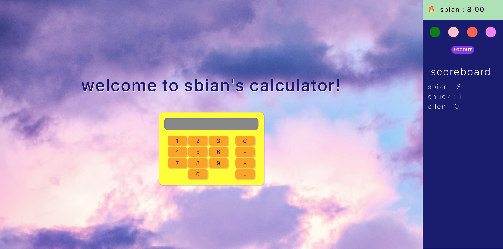

# CalculatorApp

Fun project to learn React hooks, JWT authentication, node/express, knex. 

Fully tested backend using Jest.

## Login Page
JTW Authentication w/ hashed password

## Calculator Page
Click on the username panel to expand 

## Change Theme
Background color, side panel color, and font color are persisted in the database.

## Keep score
Scores of the top 10 users are persisted in the database. You can see the top 10 user's scores recorded on the leaderboard on the right hand sie. Your score is updated every time you use the calculator to make a calculation. The score is the length of the string of your calculation.

## Testing Coverage
run `npm test`

